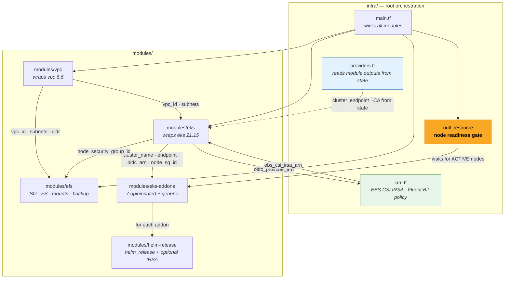
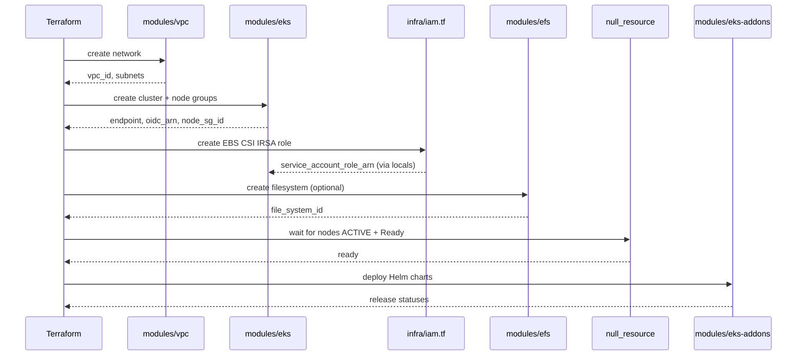
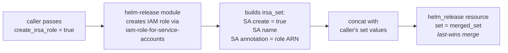

# Architecture

# Architecture

## Module dependency diagram

## Data flow

## IRSA auto-injection flow

## Layer responsibilities

| Layer | Responsibility | Dependencies |
|-------|---------------|-------------|
| `modules/vpc` | Network: VPC, subnets, NAT, IGW | None |
| `modules/eks` | Control plane: cluster, node groups, addons, IRSA OIDC | None |
| `modules/efs` | Storage: EFS filesystem, SG, mount targets, backup, lifecycle | None |
| `modules/helm-release` | Primitive: single Helm chart + optional IRSA role | None |
| `modules/eks-addons` | Composition: 7 opinionated addons + generic passthrough | `helm-release` |
| `infra/` | Orchestration: wires modules, cross-cutting IAM, readiness gate | All modules |

## Why we use wrapper modules

Every module in `modules/` wraps an upstream `terraform-aws-modules/*` community
module (or raw AWS resources for EFS). The wrappers exist for three reasons:

1. **Validate-time guardrails.** Wrappers add `variable` validation blocks that
   catch misconfigurations at `terraform validate` — before plan or apply. The
   community modules accept almost anything and fail with cryptic AWS API errors
   at apply time. Examples: NAT gateway mutual exclusion check, subnet/AZ count
   match, CIDR format validation, public endpoint CIDR blocklist.

2. **Opinionated defaults.** Wrappers encode production-safe defaults (encryption
   on, public endpoint off, all log types enabled, KMS key created) so teams
   can't accidentally deploy insecure clusters. The upstream modules default to
   permissive settings.

3. **Consistent interface.** All wrappers follow the same pattern — flat variable
   inputs, direct outputs, `versions.tf` with provider constraints. New team
   members learn one pattern and apply it everywhere.

**Rule of thumb:** We wrap when we add validation, defaults, or interface
simplification. If a wrapper would be pure passthrough with zero added logic,
call the upstream module directly from `infra/`.
